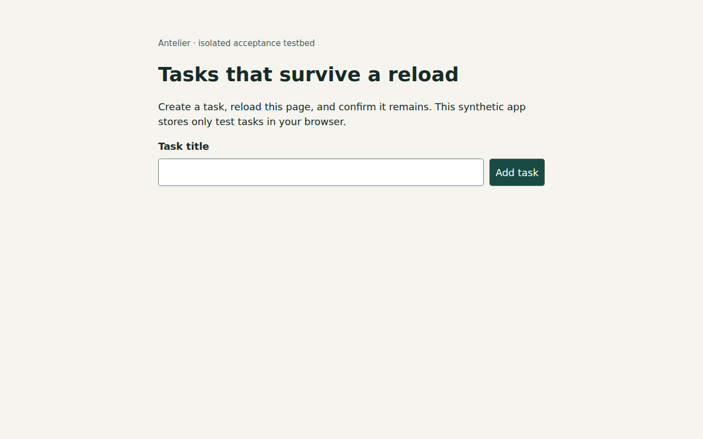
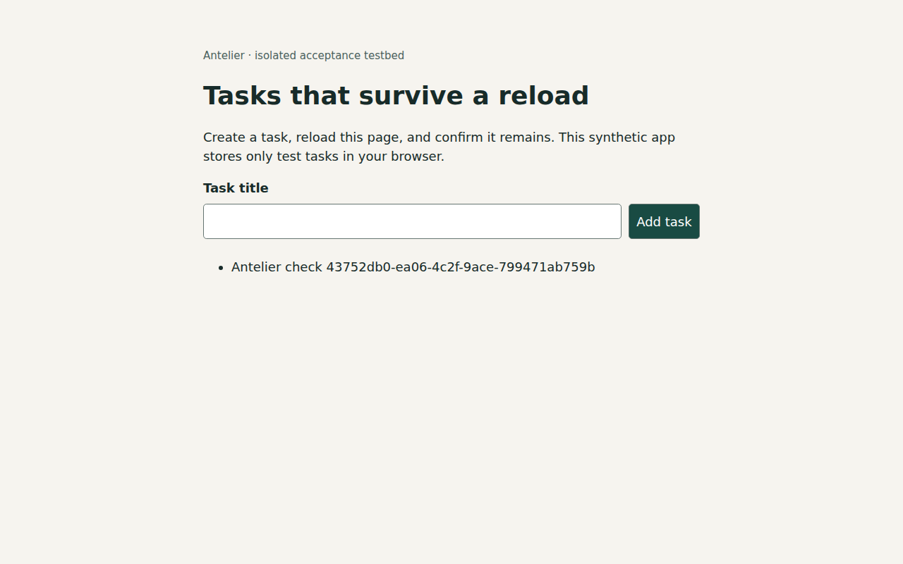

# CI passed. The task disappeared after reload.

Antelier caught the lost task by running the approved behavior against a real
Cloudflare preview. A coding agent restored the missing persistence write, and the
same expectation passed on the corrected revision.

**This is an owned synthetic demonstration, not a customer testimonial.**

[Inspect the fork PR and current comment](https://github.com/huyn7539/antelier-journeys-testbed/pull/2#issuecomment-5628589220)
· [Inspect the correction](https://github.com/antelier/antelier-journeys-testbed/commit/985709e3ea2f7daac759641a0cac9c0fc7ced972)

| What happened | Broken revision | Corrected revision |
|---|---|---|
| Existing CI smoke test | Passed | Passed |
| Create task | Appeared | Appeared |
| Reload and find the task | Missing; assertion failed | Present; assertion passed |
| Antelier behavior result | Refuted by execution | Verified by execution |
| Deployed revision | `f3b9fe0` | `985709e` |
| Approved expectation hash | `dc825049847e3bc0` | `dc825049847e3bc0` |

The expectation was not weakened to make the correction pass. Both receipts observed
the intended revision before and after execution. The same sticky comment was
updated in place.

## What the browser saw after reload

Before correction: the newly created task is missing.

After correction: the test task remains.

## Inspect the evidence

- Broken: [workflow receipt](https://github.com/huyn7539/antelier-journeys-testbed/actions/runs/34555151017), [saved comment](hosted/evidence/broken/comment.md), [report](hosted/evidence/broken/report.json).
- Corrected: [workflow receipt](https://github.com/huyn7539/antelier-journeys-testbed/actions/runs/34555272593), [saved comment](hosted/evidence/fixed/comment.md), [report](hosted/evidence/fixed/report.json).
- [Approved scenario and source identity](https://github.com/huyn7539/antelier-journeys-testbed/blob/ca0647e3d5c86ebe20a28cb6b6c728b616f8bd6a/.antelier/journeys.yml).
- [Receipt file hashes and paired identities](hosted/evidence/integrity.json).

## Try the same kind of check on your preview

The execution Action is experimental; public `antelier/action@v0` does not yet ship
this integration. Start with the [pinned execution setup guide](https://github.com/antelier/action/blob/4036703c01eeb345f834faedbb9509595770fd18/EXECUTION-VERIFICATION.md)
and its [single workflow file](https://github.com/antelier/action/blob/4036703c01eeb345f834faedbb9509595770fd18/execution-workflow.example.yml).
Replace both placeholder Action refs with
`antelier/action@4036703c01eeb345f834faedbb9509595770fd18` and configure your source CI.

Choose one behavior your team currently checks by hand. Give it an approved journey,
a non-production preview and disposable test data. The guide describes the required
preview identity and revision reporting. No revision endpoint means partial evidence,
not verification of the PR revision.

If you try it, [tell us the behavior, whether the finding changed what you did, and
what you still had to do manually](https://github.com/antelier/action/issues/new).
Do not include credentials or private app data. Those answers determine the next
piece of work to remove.

## What this demonstration does not establish

The smoke test intentionally covers something other than persistence. The defect was
seeded by us, and Codex made the one-line correction; Antelier did not autonomously
repair it. Deployment and provider-status publication were manually operated, and
the first run needed a rerun after preview readiness. This is not native Cloudflare
Builds integration or automatic scheduling.

The isolated app uses browser localStorage and has no backend or production bindings.
The deployed revision header is supplied by the controlled deployer, not an
independent build attestation. This does not establish auth, multi-user isolation,
general correctness, merge enforcement, stranger setup time, or customer time saved.

We have one approved scenario on two hosted revisions, with a correct failure and a
correct pass. Outside-user adoption and willingness to pay remain unmeasured.
